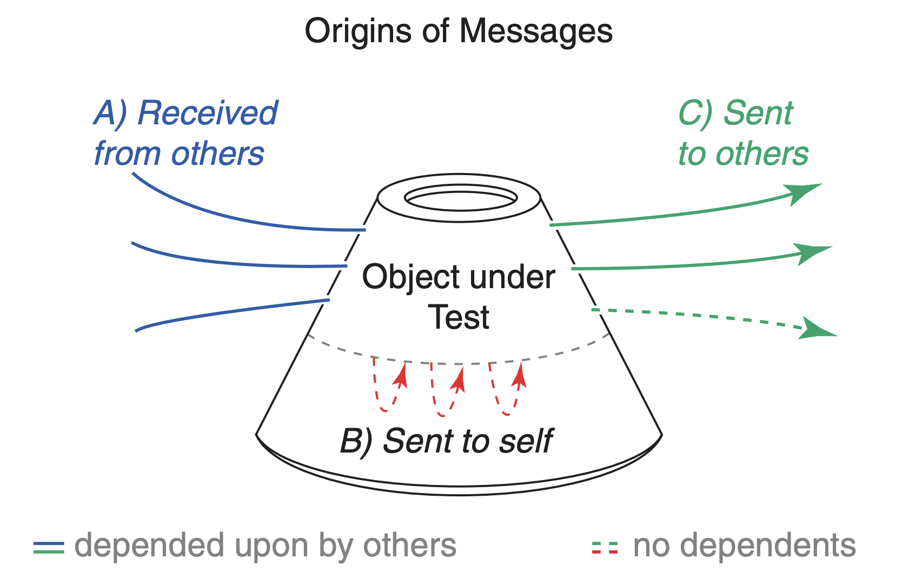
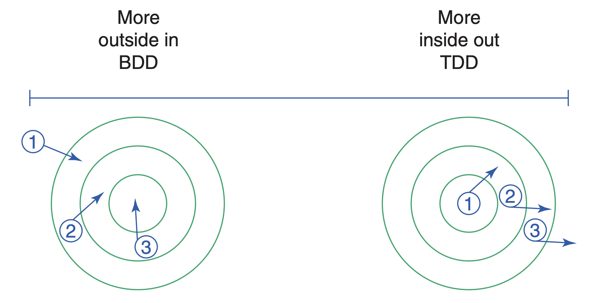

[《루비로 배우는 객체지향 디자인》](http://www.yes24.com/Product/Goods/15254976)의 9장 '비용-효율적인 테스트 디자인하기' 파트를 읽고 정리한 내용입니다.

# 손쉽게 수정할 수 있는 코드 작성하려면?

1. **객체지향 디자인에 대한 이해해야 한다.**

   실용적인 관점에서 디자인이 고려해야 하는 것은 손쉬운 수정 가능성 뿐이다. 쉽게 바꿀 수 있는 코드가 곧 잘 디자인된 코드이다.

2. **훌륭한 리팩터링 기술을 배워야 한다.**

   > 리팩터링은 소프트웨어 시스템을 수정하는 과정이다. 이 과정은 코드의 외적인 작동방식을 변경하지 않으면서도, 그 내부 구조를 발전시킨다. _- 마틴 파울러, 《리팩터링: 프로그램의 가치를 높이는 코드 정리 기술》_

   애플리케이션을 뜯어보고 여기저기로 옮기는 것은 리팩터링이 아니다. 현재의 코드 구조가 새로운 요구사항을 받아들일 수 있도록 만드는 방법이 리팩터링이다. 리팩터링이 수월하게 진행할 수 있을 때에만 디자인에 대한 고민은 그 값어치를 한다.

3. **효율적인 테스트를 짤 수 있는 능력을 길러야한다.**

   테스트는 지속적인 리팩터링에 안정감과 확신을 준다. 효율적인 테스트는 전체적인 작업 비용을 끌어올리지 않고 수정된 코드가 여전히 잘 작동한다고 보증해준다. 좋은 테스트를 작성해 놓았다면, 실제 코드를 수정해도 테스트를 다시 작성할 필요가 없다. 이러한 잘 동작하는 테스트를 작성하는 일 역시 디자인 이슈이다.

잘 디자인된 코드는 수정하기 쉽고, 리팩터링은 하나의 디자인을 다른 디자인으로 변형시키는 방법이며, 테스트는 리팩터링의 두려움에서 우리를 해방시켜준다.

# 의도를 가지고 테스트하기

테스트의 진정한 목표는 코드 작성 비용을 줄이는 것이다. (디자인의 목표와 같다.) 테스트를 작성하고 관리하는 데 드는 시간이 버그를 잡고 문서를 작성하고 테스트 코드를 디자인하는 데 드는 시간보다 오래 걸린다면 테스트를 작성하는 의미가 없다.

테스트 작성 비용이 너무 높은 문제를 해결하기 위한 방법은 테스트를 그만두는 것이 아니라, 테스트를 더 잘 짤 수 있도록 수련하는 것이다. 테스트를 통해 좋은 가치를 얻기 위해서는 테스트의 의도를 명확히 하는 것, 무엇을 언제 그리고 어떻게 테스트 해야 할지 알아야한다.

## 테스트의 의도 (Why)

1. **버그 찾아내기**

   초기 단계에 버그를 찾아내면 수정하기도 쉬울 뿐 아니라 코드를 일찍 올바르게 만들어 놓는 것이 가능하다. 미래에 선택할 수 있는 디자인의 폭을 넓힐 수 있다. 버그가 쌓여 가며 의존성을 만들어 내는 것을 방지할 수 있다.

2. **문서를 제공하기**

   종이 문서는 쓸모 없어지고 기억은 한계가 있다. 테스트는 디자인에 대한 믿을 수 있는 문서를 제공한다. 미래의 우리가 기억상실증에 걸릴 것이라 예상하고 테스트를 작성하자. 테스트는 우리가 알고 있던 이야기를 다시 들려줄 수 있다.

3. **디자인 결정을 미루기**

   어떤 것이 필요한데 아직 그 무엇을 알아 내기에는 충분한 정보가 없는 경우, 그 무엇을 위한 빈 공간을 남겨둘 수 있다. 이 미뤄진(pending) 결정의 지점들을 잘 표현된 인터페이스 뒤에 숨도록 추상화하고 테스트가 인터페이스에 기대고 있다면, 인터페이스 밑에 숨겨진 구체적인 코드는 나중에 마음껏 리팩토링 할 수 있다. 테스트는 인터페이스가 올바르게 작동하는 것을 확인해주고, 리팩터링 과정에서 테스트를 다시 작성할 필요도 없다.

4. **추상화 돕기**

   추상화된 코드는 아주 유연한 디자인 요소이며 각각은 이해하기 쉽지만, 코드 속에 전체 작동을 명확하게 보여주는 지점이 없다. 그렇기 때문에 추상화된 코드가 여럿 자라나면서 테스트가 더욱 필요해진다. 테스트는 모든 추상화된 인터페이스의 기록이기 때문에 우리의 작업을 지지해주는 기반이 된다. 테스트는 우리가 디자인 결정을 미루고 필요한 만큼 추상화된 코드를 만들 수 있도록 해준다.

5. **디자인의 결점 드러내기**

   테스트를 작성하기 위한 준비 작업이 너무 힘겹다면 코드에 너무 많은 맥락(context)가 있다는 뜻이다. 객체 하나를 테스트하기 위해 다른 객체를 왕창 끌어와야 한다면 그 코드는 의존성이 높다는 뜻이다. 즉, 테스트를 작성하기 힘들다면 다른 객체들이 그 코드를 재사용하기 힘들 것이다. (테스트는 탄광 속의 카나리아이다. 디자인이 나쁠 때 테스트는 힘들어진다.)

## 무엇을 테스트 해야하는가 (What)

애플리케이션은 여러 블랙박스가 서로 주고받는 메세지들의 연쇄이다. 각각의 블랙박스는 마치 위 그림의 우주 캡슐 같아서 안에서는 밖을 볼 수 없고, 밖에서는 안을 볼 수 없다. 최소한의 메시지들만이 밀폐된 에어로크를 통과할 수 있다.

디자인의 핵심에는 다른 객체(블랙박스)에 대한 의도적이 무지가 있다. 그저 객체를 메시지에 반응하는 존재처럼 취급할 때 코드의 수정이 쉬워진다. 테스트도 마찬가지다. 테스트는 이미 존재하는 클래스를 사용하는 또 하나의 애플리케이션이다. 테스트가 기존 클래스들과 결합할수록 불필요하게 수정해야하는 상황이 많아진다.

우리는 객체 사이의 결합을 최소화하고 그 결합 또한 안정적인 객체과 맞물리도록 만들어야한다. 모든 객체에서 가장 안정적인 것은 퍼블릭 인터페이스이다. **즉, 우리가 테스트해야하는 것은 퍼블릭 인터페이스에 정의된 메시지이다.** 객체를 감싸는 방어막을 뚫고 내부의 불안정한 세부사항을 테스트하면, 내부의 코드를 리팩터링 할때마다 테스트가 깨져나가기 때문에 유지보수 비용을 높일 뿐이다.

### 객체의 경계를 넘나드는 메시지

**들어오는 메시지 (incoming messages):** 수신하는 객체의 public interface

- 객체는 자신의 인터페이스를 테스트할 책임이 있다. ⇒ 해당 메시지가 반환하는 <strong>값(state)</strong>이 기댓값(expected value)과 같은지 검증(assertion)

**나가는 메시지 (outgoing messages):** 다른 객체에 들어가는 메시지

- Foo가 Bar의 public interface 호출하는 경우, Foo 입장에서는 나가는 메시지이지만 Boo 입장에서는 들어오는 메시지이다. 이 state에 관한 모든 테스트는 Bar에 속해야한다. Foo는 자신 밖으로 나가는 메시지의 상태를 테스트할 필요도 없고 테스트해서도 안된다. 오직 자신의 퍼블릭 인터페이스에 속하는 메시지의 상태만 검증한다. 이것이 테스트의 일반적인 원칙이다. 이 원칙을 따르면 메시지의 반환값을 테스트하는 코드는 한 곳에 존재하게 되고 중복을 제거할 수 있다.(DRY✨)
- 밖으로 나가는 메시지의 종류
  - **Queries:** 애플리케이션에 영향을 미치지 않는다. 당연히 반환값이 중요하다. ⇒ 수신자가 객체 상태값에 대한 필요한 테스트를 모두 구현해야한다. 송신자에서 테스트하지 말 것!🙅🏻‍♂️
  - **Command:** 파일을 만들거나 DB에 레코드 저장하거나 옵저버가 관찰하고 있거나 등등. 메시지가 전송되었는지 테스트하는 것은 송신자의 책임. 이 테스트는 state에 대한 테스트가 아닌 <strong>행동(behavior)</strong>에 대한 테스트이다. 메시지가 몇번 전송 되었는지, 인자는 무엇인지 테스트한다.

애플리케이션은 퍼블릭 인터페이스를 따르며 소통하고 있다면 테스트는 이 이상을 알 필요가 없다. 최소한의 메시지만 테스트하면 그 이상을 알 필요가 없다. 밖으로 나가는 command 메시지가 제대로 전송되었는지 테스트한다면 실제 코드와 느슨하게 결합되어 있기 때문에 실제 코드가 변경되어도 테스트를 수정할 필요가 없다.

## 언제 테스트를 해야하는가 (When)

> _"기본적으로 테스트를 먼저 작성하는 것이 좋다. 이게 말이 되는 상황이라면"_

**왜 애플리케이션 코드를 작성한 이후 테스트를 작성할 때 어려울까?**
초보들은 객체 속에 별로 연관되지 않은 책임을 부여하거나 너무 많은 객체들에 의존하게 만든다. 이러한 코드에는 독립적으로 움직이는 객체가 없다. 테스트는 코드를 재사용하는 것인데 이 애플리케이션에는 재사용할 코드가 없기 때문이다.

- 테스트를 먼저 작성하면 객체를 처음 만드는 순간부터 재사용 가능성을 각인시켜 놓게 되는 장점이 있다.
- 하지만, 테스트를 먼저 작성한다 ≠ 제대로 디자인된 애플리케이션의 완성
  - 작성 비용 높고, 중복 많은 테스트 코드를 작성하지 않도록 주의할 것
  - 수정이 어렵고 리팩터링이 모든 테스트를 깨뜨리면 생산성이 떨어지고 의욕을 잃게 만든다. ⇒ 테스트가 쓸모없게 느껴진다. ⇒ 제대로된 시점에 적당한 양의 테스트를 작성해야한다. 애플리케이션 뿐만 아니라 테스트 코드에도 디자인 원칙을 적용 해야한다.

스스로의 능력을 너무 과신해서 자신의 관점에 함몰되어 테스트를 생략해도 된다고 생각하지 말자!

## 어떻게 테스트를 해야하는가 (How)

### Test Driven Development vs. Behavior Driven Development

두가지 사이에서 깔끔하게 한가지를 선택할 수는 없다.이 둘은 정반대가 아니라 그림처럼 서로 이어진 것으로 생각해야한다. (두 스타일 모두 테스트를 먼저 작성한다.)

| BDD                                                      | TDD                                       |
| -------------------------------------------------------- | ----------------------------------------- |
| 밖에서 안으로 들어오는 접근 (outside-in)                 | 안에서 밖으로 들어오는 접근 (inside-out)  |
| 가장 바깥쪽에 있는 객체들을 먼저 만든다.                 | 도메인 객체에 대한 테스트로 시작          |
| 아직 만들지 않은 객체들은 mocking하며 안쪽으로 들어간다. | 재사용하면서 바깥 층으로 테스트 작성한다. |

**⚠️ 테스트 작성 시 알아야 하는 것 vs. 몰라야 하는 것**

- **알아야 하는 것:** 테스트중인 객체
- **몰라야 하는 것:** 그 외의 모든 객체

테스트 중인 객체 외의 다른 부분들이 뿌옇고 불투명하다고 가정해야한다. 테스트 단계에서 알고 있는 정보는 테스트 중인 객체를 보면서 얻은 정보뿐이다.

테스트 중인 객체의 가장자리를 따라 시선을 고정하고, 그 경계를 넘나드는 메시지만 테스트하는 것이 좋다. (내부나 작동 방식에 집중하면 프라이빗한 지식이 테스트를 침범하고, 결합이 강해진다.)

## Summary

테스트는 꼭 필요하다. 잘 디자인된 애플리케이션은 매우 추상적이고, 계속 변경된다. 테스트가 없다면 이해할 수도 없고 안전하게 수정할 수도 없을 것이다. 최상의 테스트는 실제 코드와 느슨하게 결합되어야 한다. 그리고 모든 코드를 한번만, 제대로 된 장소에서 테스트해야 한다. 이런 테스트는 코드 작성 비용을 높이지 않으면서도 새로운 가치를 제공한다.

잘 디자인된 애플리케이션이 섬세하게 다듬어진 테스트 묶음을 가지고 있다면 이 애플리케이션을 바라보기만 해도 기쁘고 확장하는 작업도 즐겁다. 모든 새로운 상황에 적응할 수 있으며 예상치 못했던 그 어떤 요구사항에도 대처할 수 있다.
