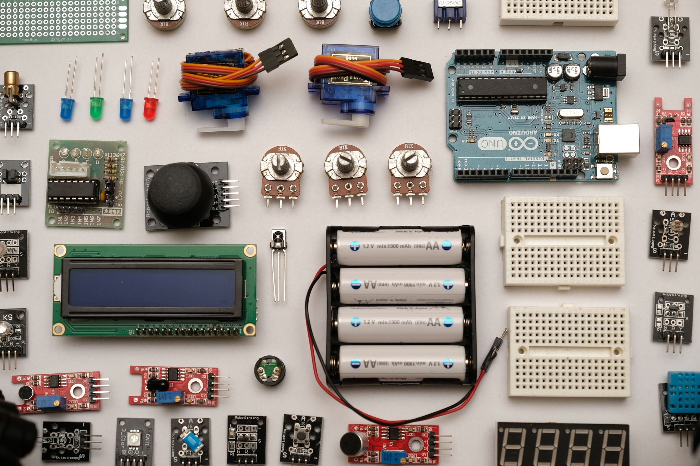
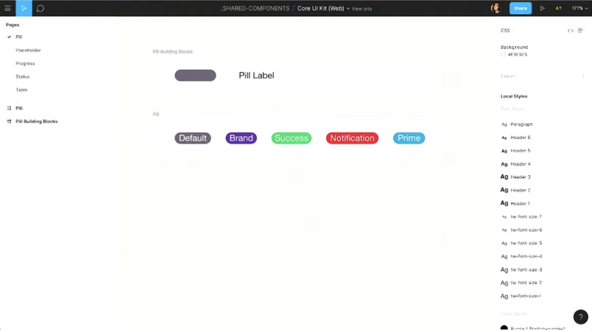
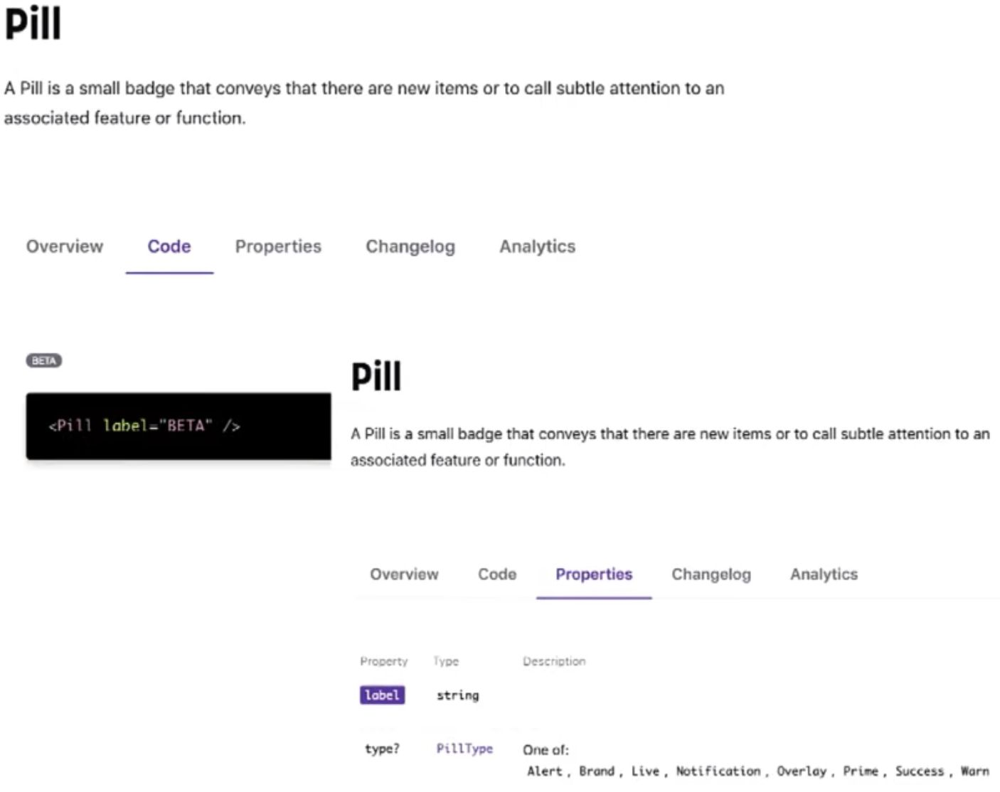
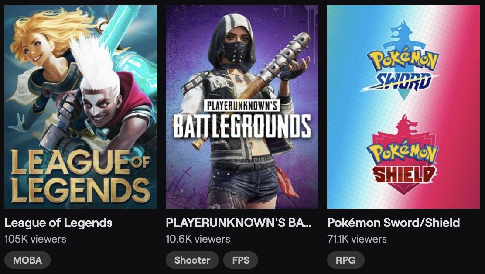
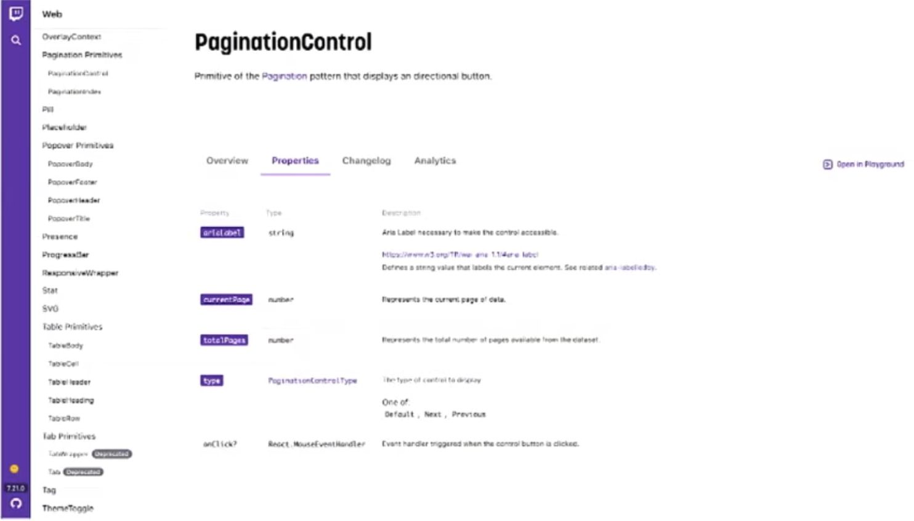

[JSConf Korea 2019](https://2019.jsconfkorea.com/)의 ["How TypeScript Can Power Design System"](https://youtu.be/hbsIOHktvfo) 발표를 보고 정리한 내용입니다.



## 발표자 소개

[Isha Kasliwal](https://twitter.com/ikasliwal)은 Twitch의 Design System 팀에 시니어 UI/UX Designer/Developer입니다. 이전에는 Salesforce의 [Ligntning Design System](https://www.lightningdesignsystem.com/) 팀에서 일했다고 합니다.

## 디자인 시스템은 무엇인가?

확장 가능하고 반복 가능한 방식으로 제품을 개발할 수 있도록 **필요한 모든 엘리먼트를 그룹화해놓은 단일 정보 소스(the single source of the truth)**입니다.

디자인 시스템은 실제 눈에 보이는 것과 그렇지 않은 것으로 구성됩니다. 가령,

- 눈에 보이는 컴포넌트, 재사용 가능한 리소스 등
- 추상적인 요소들 (brand values, UI/UX best practices 등)

### 디자인과 개발의 교차점

디자인 시스템은 디자인과 개발, 두 업무의 교차점이기도 합니다. UI/UX와 코드 동작을 규정하는 가이드라인, 팀이 동일한 환경과 방향 안에서 제품을 확장할 수 있는 규약과 원칙을 디자인과 코드로 구현한 것입니다.

### 디자인 시스템 ≠ 디자인 + 코드

디자인 시스템은 디자인과 코드 그 이상으로 방대합니다. 전체 서비스에서 재사용 할 수 있도록 컴포넌트를 만들고 제공하기 위해서는 다양한 요구사항을 반영 해야하며 많은 기술적 도전 과제가 수반됩니다. 다음과 같은 것들이 모두 포함될 수 있습니다.

> 색상 팔레트, 디자인 패턴, 아이콘, 사용자 지원, 문서화, 컴포넌트, 애니메이션, 디자인 도구화, 일러스트레이션, 타이포그래피, 모션, 가이드라인, messaing, code 등

### 디자인 시스템을 사용하고 있는 회사들

- [Google](https://material.io/)
- [Amazon Web Service](https://abduzeedo.com/amazon-web-services-design-system)
- [Facebook](https://facebook.design/toolsandresources/)
- [IBM](https://www.carbondesignsystem.com/)
- [Airbnb](https://airbnb.design/building-a-visual-language/)
- [Twitch](https://www.alexisgallisa.com/portfolio/twitch-design-system)
- [Salesforce](https://www.lightningdesignsystem.com/)
- [Shopify](https://polaris.shopify.com/)

### 개발 프로세스 예시

1. **`Ideation(관념화)`**

   일반적으로 특정 컴포넌트가 필요한지 관념화하는 과정부터 시작합니다. 예시로 Twitch의 디자인 시스템 팀에서는 *다른 엘리먼트와 함께 한 줄에 상태를 표시해 줄 수 있는 UI 엘리먼트*가 필요하다는 것을 발견하였습니다. UX 리서치와 모범 사례들을 통해 알약처럼 생긴 UI가 가장 적합하다고 결론 내렸습니다.

2. **`Design`**

   관념화한 컴포넌트가 필요하다고 판단되면 디자인에 착수합니다. 아래는 Twitch에서 디자이너들이 사용하는 [Figma](https://www.figma.com/) UI kit의 Pill 컴포넌트 예시입니다.

   

3. **`Code`**

   많은 디자인 시스템 팀의 주된 목표는 view layer와 다른 엔지니어들이 손쉽게 사용 가능한 API를 제공하는 것입니다. 이를 위한 디자인에 관련된 많은 옵션, 규칙과 문서들을 React, JavaScript, TypeScript를 사용하여 관리할 수 있습니다.

   아래는 TypeScript로 작성한 코드와 문서의 예시입니다. 타입과 인터페이스를 기반으로 `props` 관련 문서화를 손쉽게 할 수 있습니다.

   ```typescript
   export enum PillType {
     Notification = 'tw-pill--notification',
     Brand = 'tw-pill--brand',
     Live = 'tw-pill--live',
     Alert = 'tw-pill--alert',
     Success = 'tw-pill--success',
     Prime = 'tw-pill--prime',
     Overlay = 'tw-pill--overlay',
     Warn = 'tw-pill--warn',
   }

   export interface PillProps {
     label: string
     type?: PillType
     transfrom?: TextTransform
   }

   export const Pill: React.SFC<PillProps> = props => {
     const classes: ClassValue = {
       'tw pill': true,
     }

     if (props.type) {
       classes[props.type] = true
     }

     return (
       <CoreText
         type={TextType.Span}
         transfrom={props.transform}
         fontWeight={FontWeight.SemiBold}
         className={cn(classes)}
         {...getDataProps(props)}
       >
         {props.lable}
       </CoreText>
     )
   }

   Pill.defaultProps = {
     transform: TextTransform.Uppercase,
   }

   Pill.displayName = 'Pill'
   ```

   

4. **`Procuction`**

   웹 사이트, 모바일 웹 등 모든 타입의 웹앱 프로덕션에서 쓰일 수 있는 단계입니다. `Pill` 컴포넌트를 동료 디자이너, 개발자들이 상태를 표현하기 위한 UI로 사용할 수 있게 되었습니다.👏🏻

   

## TypeScript는 무엇인가?

- JavaScript로 컴파일되는, JavaScript의 타입이 있는 상위 집합 (typed superset)
- Optional static typing, classes 그리고 interface를 제공

### 장점

1. **스타일 별 `props` 타이핑 하기**

   ```typescript
   export interface CoreLinkProps {
     children?: React.ReactNode
     className?: string
     type?: CoreLinkType
     to?: history.LocationDescriptor
     underline?: boolean
     hoverUnderlineNone?: boolean
     hoverColorInherit?: bollean
   }
   ```

   이를 통해 아래와 같은 장점이 있습니다.

   1. 시각 요소들에 대한 일관성 확보
   2. 각 prop의 목적을 명확히 표현
   3. 변수들의 변이(mutations) 방지

2. **IDE**

   자동완성, 스니펫 생성, 전체 코드베이스에 걸친 renaming, 에러 컴파일 등

3. **export 가능한 인터페이스**

   ```typescript{1,9}
   export interface CoreInteractivePublicProps extends CoreMouseHandlers {
     ariaLabel?: string
     autoFocus?: boolean
     blurAfterClick?: boolean
     // ...
   }

   // 위 interface를 extends 한다.
   export interface CoreLinkProps extends CoreInteractivePublicProps {
     children?: React.ReactNode
     className?: string
     type?: CoreLinkType
     // ...
   }
   ```

   인터페이스로 컴포넌트의 의도를 매끄럽게 표현할 수 있습니다. (내부 구현을 노출하지 않고 컴포넌트가 무엇을 필요로 하고, 행할 수 있는지를 나타낼 수 있기 때문)

   또한 인터페이스를 export하여 비슷한 컴포넌트 끼리 같은 인터페이스를 공유하게 함으로써 일관성을 높일 수 있습니다. 위의 예제에서는 링크와 관련된 인터랙션 관심사를 `CoreInteractivePublicProps` 로 분리 한 뒤, `Link` 컴포넌트에서 확장(extneds) 하였습니다.

### TypeScript & Design System

타입스크립트는 디자인과 개발 사이의 강력한 신뢰와 관계를 만드는데 도움이 됩니다.

- 디자이너는 디자인이 올바르게 구현되고 있음을 신뢰할 수 있습니다.
- 개발자는 컴포넌트 사용 시 필요한 정보들에 대해 올바르게 접근하고 있는지 신뢰할 수 있습니다.

### 개발자 측면에서의 장점

컴포넌트 props의 interface로 정적 코드 분석을 쉽게 활용하고 개발자와 디자이너에게 더 나은 도구들을 제공 할 수 있습니다.

1. **인터페이스 지향 개발 (Interface Oriented Development)**

   타입스크립트는 컴포넌트를 가져다 쓰는 개발자가 내부 코드를 모두 알 필요 없이, 노출된 인터페이스만을 통하여 개발할 수 있도록 합니다. ⇒ 코드 베이스에 초기 정착 과정이 쉽고, 디자인 관련된 프론트엔드 코드들에 대해 자동 완성 기능이 뛰어납니다.

2. **정적 코드 분석**

   타입스크립트로 작성된 컴포넌트의 interface를 읽어 각 컴포넌트의 props 정보를 문서화하여 다른 개발자들이 참조하기 쉽도록 제공할 수 있습니다.

   

3. **기능성 테스트를 위한 Playground**

   playground 기능을 제공하여 개발자들이 `props`를 실시간으로 바꾸어가며 곧바로 어떻게 바뀌는지 볼 수 있습니다.

### 디자이너 측면에서의 장점

1. **표현할 UI의 형태들이 컴포넌트에 포함된다.**

   ```typescript
   export enum ProgressBarSize {
     Default = '',
     Small = 'sm',
     ExtraSmall = 'xs',
   }

   export enum ProgressBarStatus {
     Default = 'default',
     Caution = 'caution',
     Error = 'error',
     Success = 'success',
   }

   export enum ProgressBarAnimationDirection {
     Up = 'up',
     Down = 'down',
   }

   export interface ProgressBarProps {
     animationDuration?: number
     animationDirection?: ProgressBarAnimationDirection
     borderRadius?: BorderRadius
     size?: ProgressBarSize
     status: ProgressBarStatus
     // ...
   }
   ```

   인터페이스와 enum의 조합으로 컴포넌트가 표현할 디자인 형태들을 포함시킬 수 있으므로, 특정 클래스 이름 등을 알고 있는 코드를 복사-붙여넣기 하지 않고도 UI를 구축할 수 있습니다. 디자이너는 시안에 모든 변경에 대해 일일이 수정할 필요가 없고, 개발자는 무엇이 어떻게 변할 지 정확히 예측할 수 있습니다.

2. **정보의 원천을 디자인에서 관리**

   정보의 원천을 디자인에서 관리하도록 할 수 있습니다. 예를 들면, Figma UI 키트에 사용하는 타이포그래피, 색상, 텍스트 타입에 대해 변수 이름을 매핑할 수 있을 것입니다. 이렇게 지정한 이름과 값들이 컴포넌트에 prop으로 그대로 사용 되기 때문에, 코드 효율성과 디자인 일관성을 보장하는 시스템을 유지할 수 있습니다.

### 비지니스/사용자 측면에서의 장점

> TypeScript를 사용함으로써 약 15%의 버그를 사전에 막을 수 있다. - [To type or not to type: quantifying detectable bugs in JavaScript](https://blog.acolyer.org/2017/09/19/to-type-or-not-to-type-quantifying-detectable-bugs-in-javascript/)

강력한 타이핑을 통해 발생 가능한 버그를 사전에 줄이고, 프로젝트 관리 및 비즈니스 측면에 집중할 수 있습니다. 물론 버그가 적으니 사용성도 좋아질 것입니다.

## 의도(intent)는 영향도(impact)를 따른다.

”형태(form)는 기능(function)을 따른다.”는 말이 있습니다. 코드 작성에 적용해 보면 구조의 형태, 더 나아가 사용하기로 선택한 도구와 그것을 사용하는 방법 등은 기능에 의해 결정된다는 것 입니다. 웹 개발과 관련하여 우리가 하는 모든 작업의 목적은 보다 유용하고 안전한 웹 사이트, 앱을 만드는 것입니다. **개발자와 디자이너로써 우리가 만드는 모든 것의 의도는 사용자에게 미치는 영향을 따라야 합니다.** 새로운 라이브러리, 프레임워크를 사용하는 것은 멋진 일이지만, **사용자 그리고 유지보수 할 동료에게 어떠한 긍정적인 영향을 줄 수 있는지 고려하는 것이 중요합니다.** 프레임워크를 만드는 사람이라면, 안전과 유용성을 늘 염두 해야 합니다. 사용자가 구축하고 세상에 내놓는 소프트웨어의 의도는 생각보다 큰 영향을 끼칩니다. 따라서 모든 사람의 안전과 신뢰를 고려하는 도구를 사용하는 것이 중요합니다.
