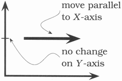
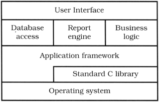

[《실용주의 프로그래머》](http://book.naver.com/bookdb/book_detail.naver?bid=7467119) 2장 '실용주의 접근법'의 '직교성' 파트를 읽고 정리한 내용입니다.

### 왜 직교성에 대해 알아야 할까?

직교성의 개념은 우리가 배우는 여러 다른 방법론과 기법에 잠재되어 있다. 직교성의 원칙을 적용하는 걸 직접 배우게 되면 우리가 만드는 시스템의 질을 즉각 개선할 수 있다.

## 직교성(Orthogonality)이란?

‘직교성’은 기하학에서 빌려온 용어이다. 위 그래프의 축과 같이 두 직선이 직각으로 만나는 경우 직교한다고 말한다. 벡터의 입장에서 보면, 두 개의 선은 ‘독립적’이다. x축 방향으로 움직여도, y축에서의 위치는 변하지 않는다.

컴퓨팅에서는 일종의 독립성(independence)이나, 결합도 줄이기(decoupling)를 의미한다. 하나가 바뀌어도 나머지에 어떤 영향도 주지 않으면 서로 직교한다고 할 수 있다. (e.g. 데이터베이스 코드와 UI 코드)

## 직교성의 장점

비직교적인 시스템은 본질적으로 변화와 조정하기가 복잡하다. 시스템의 컴포넌트들이 고도로 상호의존적인 경우, 특정 부분만 수정하는 방법이 없다.

> 관련 없는 것들 간에 서로 영향이 없도록 하라.

우리는 자족적(self-contained)인 컴포넌트를 설계하기 원한다. 독립적이며, 단일하고 잘 정의된 목적을 가진 컴포넌트. 컴포넌트들이 각기 격리(isolated)되어 있으면 어느 하나를 바꿀 때 나머지 것들을 걱정하지 않아도 된다. 외부 인터페이스를 바꾸지 않는 한, 전체 시스템으로 퍼져 문제를 일으키지는 않으리라고 안심할 수 있다.

### 생산성 향상

- 변화가 국소화되서 개발 시간과 테스트 시간이 줄어든다. 상대적으로 작고, 자족적인 컴포넌트를 작성하는 것이 하나의 커다란 코드 덩어리를 만드는 것보다 더 쉽다. 새로운 코드를 추가할 때마다 기존의 코드를 계속 바꾸어야할 필요가 없다.
- 직교적인 접근법은 재사용을 촉진한다. 컴포넌트들에 명확하고 잘 정의된 책임이 할당되어 있다면 초기엔 생각하지 못했던 방식으로 새롭게 결합할 수도 있다. 느슨하게 결합(coupling)되어 있을수록 재설정(reconfigure)하고 리엔지니어링하기 쉽다.

### 리스크 감소

- 감염된 코드가 격리된다. 어떤 모듈의 문제가 시스템의 나머지 부분으로 전파될 확률이 낮다. 게다가 새롭고 건강한 것으로 이식하기도 쉽다.
- 시스템이 잘 깨어지지 않는다. 어떤 부분을 골라 약간만 바꾸고 수리해도 거기서 생기는 문제점들은 그 부분에만 한정될 것이다.
- 해당 컴포넌트들에 대해 테스트를 설계하고 실행하기 훨씬 쉽다. → 더 많은 테스트를 하게 된다.
- 써드파티에 연결되는 인터페이스들이 전체 개발의 작은 부분에 한정된다. → 특정 벤더, 플랫폼에 덜 종속된다.

## 설계 (Design)

시스템은 협력하는 모듈들의 집합으로 구성되어야 하고, 각 모듈은 다른 부분과 독립적인 기능으로 구현해야 한다. 때로는 이런 컴포넌트들이 레이어로 조직되기도 하는데, 각 레이어는 하나의 추상화 층을 이루게 된다.

각 레이어는 자기 밑에 있는 레이어들이 제공하는 추상화만을 사용하기 때문에, 코드에 영향을 끼치지 않으면서 아래에 있는 다른 구현들을 바꾸는 높은 유연성을 얻을 수 있다. (아래 도식처럼 전형적인 레이어의 예를 참고)

직교적인 설계를 테스트하는 손쉬운 방법은 ‘특정 기능에 대한 요구사항을 극적으로 변경 했을 경우, 몇 개의 모듈이 영향을 받는가?’ 질문해보는 것이다. 직교적인 시스템에서는 답이 ‘하나’여야 한다. GUI 버튼을 옮기는 것 때문에 데이터베이스의 스키마, 빌링 서브 시스템을 바꾸어선 안된다.

또한 현실 세계의 변화와 설계 사이의 결합도를 얼마나 줄였는지에 대해서도 스스로 물을 수 있다. 전화번호를 사용자 ID로 사용하는가? 전화 회사가 지역번호를 재할당한다면 어떻게 할 것인가? 자신의 힘으로 제어할 수 없는 속성에 의존하지 마라.

## Coding

- **코드의 결합도를 줄여라.** 부끄럼타는 코드(shy code)를 작성하라. 즉 불필요한 어떤 것도 다른 모듈에 보여주지 말고, 다른 모듈의 구현에 의존하지 않는 코드를 작성하라
- **전역(global) 데이터를 피하라.** 코드가 전역 데이터를 참조할 때마다, 코드는 해당 데이터를 공유하는 다른 컴포넌트와 묶이게 된다. 모듈이 필요로하는 컨텍스트를 명시적으로 넘겨주면 코드를 이해하고 유지보수하기 쉽게 된다.
- **유사한 함수를 피하라.** 중복 코드는 구조적 문제의 징후다. [Strategy pattern](https://en.wikipedia.org/wiki/Strategy_pattern)을 사용하여 더 나은 구현을 할 수 없는지 고려하라.

## 직교적으로 살아가기

직교성은 [DRY 원리](https://en.wikipedia.org/wiki/Don%27t_repeat_yourself)와도 밀접한 관계가 있다. DRY 원리는 시스템 내부의 중복을 최소화시키고, 직교성은 시스템 컴포넌트 간의 상호의존도를 줄인다. DRY 원리로 무장하고 직교성 원리를 충실히 사용한다면 개발하고 있는 시스템이 더 유연하고, 이해하기 쉽고 또한 디버그, 테스트, 유지도 쉬워질 것이다.

만약 무언가 하나를 변경하기 위해 많은 일을 하는 혹은 하나를 변경할 때마다 다른 네 개의 무언가가 이상해진다면 그 프로젝트는 아마도 직교적으로 설계되거나 코딩되지 않았을 것이다. (리팩터링을 할 시간이다.)
