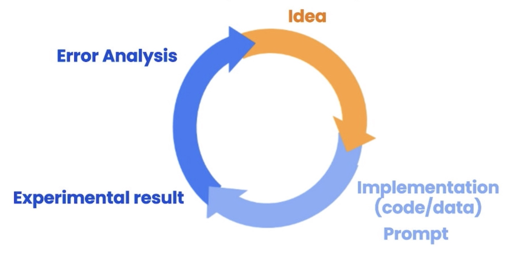

[ChatGPT Prompt Engineering for Developers](https://www.deeplearning.ai/short-courses/chatgpt-prompt-engineering-for-developers) 강의를 들으면서 정리한 내용입니다. 강의에서는 Python을 사용하는데 저는 익숙한 TypeScript, Node.js로 예제 코드를 따라하면서 들었습니다. 제가 작성한 전체 예제 코드는 [이 GitHub repo](https://github.com/hewonjeong/prompt-engineering)에서 보실 수 있습니다.

## ✌️ 두가지 유형의 LLM

1. 기본 LLM (Base LLMs)
   - 인터넷 및 대량의 학습 데이터를 기반으로 다음 단어를 예측한다.
   - 예를 들면 ‘옛날옛적에 유니콘이’를 입력하면 → ‘마법의 숲에 다른 유니콘 친구들과 함께 살았다’를 예측하는 방식
   - 하지만 ‘프랑스의 수도는?’ 라고 입력하면 ‘프랑스의 가장 큰 도시는? 프랑스의 인구는?’ 등 인터넷에 많은 프랑스에 대한 퀴즈 목록으로 답할 수 있다.
2. 명령어 튜닝 LLM (Instruction-tuned LLMs)
   - 기본 LLM에서 명령어를 잘 따르도록 인간 피드백을 통한 강화 학습(Reinforcement learning from human feedback, RLHF)을 통해 fine-tuning
   - 대부분의 애플리케이션에서 명령어 튜닝 LLM이 더욱 안정적이다. (이 코스에서도 주로 명령어 튜닝 LLM에 초점을 맞춘다.)
   - 명령어 튜닝 LLM을 사용할 때는 똑똑하지만 작업의 세부 사항을 모르는 사람에게 지시한다고 생각하면 된다. (예를 들면 '앨런 튜링에 대한 글을 써줘’ 보다 글의 초점을 어디에 맞출지, 어조는 어떻게 할지 등을 알려주는 식)

## 💎 핵심 원칙

### 명확하고 구체적인 지침을 작성하기

보통은 길수록 더 명확하고 맥락을 제공할 수 있어 좋은 출력을 유도할 수 있다. (짧은 프롬프트 ≠ 명확한 프롬프트)

- 구분 기호(` ``` `, `<text></text>`, `"""` 등)를 사용하여 특정 텍스트와 나머지 프롬프트를 분리하기. 프롬프트 주입(prompt injection)을 피하기에도 유용하다.
- HTML, JSON 등과 같은 구조화된 출력을 요청하기
- 조건이 충족되는지 모델에게 확인하도록 요청하기
- 작업의 성공적인 실행 예를 제공하기 (Few-shot prompting)

  ```ts
  const prompt = `
  일관된 스타일로 대답해줘
  
  <어린이>: 인내심에 대해 알려주세요.
  
  <할머니>: 가장 깊은 골짜기를 깎아내는 강물은 조그만 샘물로부터 흘러나오고,
  가장 웅장한 교향곡은 하나의 음에서 시작되고,
  가장 복잡한 직물 공예 작품도 단 하나의 실에서부터 시작된단다.
  
  <어린이>: 회복탄력성에 대해 알려주세요.
  `

  const response = await getCompletion(prompt)
  console.log(response)
  ```

  ```
  <할머니>: 가장 힘들게 굽힌 나무는 가장 높이 튀어오르고,
  가장 깊게 파인 우물은 가장 맑은 물을 담고,
  가장 힘들게 이겨낸 시련은 가장 강한 내면을 만들어준단다.
  ```

### 모델에게 생각할 시간을 주기

모델이 성급하게 결론에 도달하여 추론 오류를 범하는 경우, 짧은 시간이나 적은 단어로 수행하기에는 너무 복잡한 작업을 요청하고 있는 것은 아닌지 확인해보아야 한다. 모델이 답변을 제공하기 전에 관련된 추론을 순차적으로 수행하도록 쿼리를 재구성할 수 있다.

1. 작업을 위해 필요한 단계를 지정하기

   ```ts
   const text = `In a charming village, siblings Jack and Jill set out on a quest to fetch water from a hilltop well. As they climbed, singing joyfully, misfortune struck—Jack tripped on a stone and tumbled down the hill, with Jill following suit. Though slightly battered, the pair returned home to comforting embraces. Despite the mishap, their adventurous spirits remained undimmed, and they continued exploring with delight.`

   const prompt = `
   Your task is to perform the following actions:
   1 - Summarize the following text delimited by triple quotes with 1 sentence.
   2 - Translate the summary into Korean.
   3 - List each name in the Korean summary.
   4 - Output a json object that contains the following keys: koreanSummary, names.
   
   Respond in JSON format.
   """${text}"""
   `

   const response = await getCompletion(prompt)
   console.log(response)
   ```

   ```json
   {
     "koreanSummary": "두 형제 Jack과 Jill은 언덕 꼭대기에 있는 우물에서 물을 가져오기 위해 여행을 떠나지만, Jack이 걸려 넘어져 언덕을 굴러내리는 불운을 만나지만, 그들은 여전히 모험적인 정신으로 집으로 돌아와 기쁨으로 탐험을 계속합니다.",
     "names": ["Jack", "Jill"]
   }
   ```

2. 모델이 섣부르게 결론을 내리지 않고 스스로 답을 추론하도록 명시적으로 지시하기

   ```ts
   const question = `첫번째 항이 10, 다섯번째 항이 -2인 등차수열에 대하여 -29는 몇 번째 항인지 구하시오.`

   const solution = `a₅ - a₁ = -2 - 10 = -12\nd = (a₅ - a₁) / (5 - 1) = -12 / 4 = -3\naₙ = a₁ + (n - 1)d\n-29 = 10 + (n - 1)(-3)\n-29 = 10 + -3n + 3\nn = 12
   `

   const prompt = `
   학생이 제출한 답을 채점하려고해. 다음 주어진 순서대로 작업을 수행해
   
   1. 이 문제에 대한 너의 문제 풀이와 답을 먼저 작성해
   문제: ${question}
   
   2. 학생이 제출한 답과 너의 답을 비교하여 정답인지 아닌지 판단해
   학생이 제출한 답: ${solution}
   
   다음 형식으로 응답해줘
   실제 정답: {너가 작성한 문제 풀이와 구한 최종 정답}
   학생의 정답 여부: {학생의 답이 위에서 구한 실제 답의 일치 여부 (정답 또는 오답)}
   `

   console.log(await getCompletion(prompt))
   ```

   ```
   실제 정답: aₙ = a₁ + (n - 1)d
   aₙ = 10 + (n - 1)(-3)
   -29 = 10 + -3n + 3
   -29 = -3n + 13
   -42 = -3n
   n = 14

   학생의 정답 여부: 오답
   ```

### 모델의 한계

- 언어 모델은 학습 과정에서 방대한 양의 지식에 노출되었지만 그 정보를 완벽하게 암기한 것은 아니기 때문에 지식의 경계를 잘 모른다.
- 모호한 주제에 대해 그럴듯하게 들리지만 사실이 아닌 답을 만들어낼 수 있다. (**환각, hallucinations**)
- 환각을 줄이기 위한 전략
  1. 모델에게 텍스트와 관련된 인용문을 먼저 찾고, 해당 인용문을 사용하여 질문에 답하도록 요청하기
  2. 기존에 존재하는 문서를 기반으로 답하도록 요청하기

## ♻️ 반복적 프롬프트 개발

LLM을 사용하여 애플리케이션을 구축할 때 잘 동작하는 프롬프트를 한번에 작성하는 것은 매우 어렵고 중요하지도 않다. 프롬프트 개발은 반복적인 과정이다. 중요한 것은 **애플리케이션에 효과적인 프롬프트를 개발할 수 있는 좋은 프로세스**를 갖추는 것이다. (Iterative prompt development)



머신러닝 개발에서 효과적인 모델을 얻기 위해 학습과 결과를 살펴보는 과정을 반복하는 것처럼, 애플리케이션을 위한 프롬프트를 작성할 때의 프로세스도 매우 유사하다.

1. 수행하려는 작업에 대한 아이디어를 얻고
2. 명확하고 구체적이며 시스템이 생각할 시간을 줄 수 있는 프롬프트(핵심 원칙!)를 작성하고
3. 결과를 확인하고
4. 잘 작동하지 않는다면 원인을 파악하여 1로 돌아간다.

좀 더 성숙하고 정교한 애플리케이션의 경우, 수십 수백개의 예시 집합을 갖춰놓고 프롬프트를 반복적으로 개발하고 테스트하기도 한다. 여러 예시에 대한 평균 또는 최악의 성능을 확인하여 프롬프트를 평가하는 것이 유용할 때가 있다.

## ✨ 활용 사례

### 요약하기(Summarizing)

- 오늘날 세상에는 텍스트가 너무 많아 다 읽을 수 없다. 텍스트가 많은 애플리케이션에서 간단한 요약을 제공하여 사람들이 내용을 빠르게 파악할 수 있도록 도울 수 있다.
- 특정 정보(예를 들면 사용자의 리뷰에서 배송, 가격에 대한 부분)에 중점을 두고 요약하거나 해당 정보만 추출하도록 요청할 수 있다.

```ts
const review =
  '딸의 생일 선물로 이 팬더 봉제 인형을 받았는데, 딸이 좋아해서 어딜 가나 가지고 다녀요. 부드럽고 매우 귀엽고 표정이 친근해 보여요. 하지만 제가 구매한 가격에 비해 크기가 조금 작아요. 같은 가격에 더 큰 다른 제품도 있을 것 같아요. 예상보다 하루 일찍 도착해서 아이에게 주기 전에 제가 먼저 가지고 놀 수 있었어요.'

const prompt = `
이커머스 사이트의 제품 리뷰에 대한 요약을 생성하여 제품의 가격을 결정하는
가격 책정 부서에 피드백을 제공하는 작업을 수행하려고 해.

세 개의 따옴표로 구분된 아래 리뷰를 가격과 소비자가 느끼는 가치의
모든 측면에 중점을 두고 최대 30단어 이내로 요약해줘.

"""${review}"""
`

const summary = await getCompletion(prompt)
console.log(summary)
```

```
부드럽고 귀여운 팬더 봉제 인형, 딸이 좋아해요. 가격 대비 크기는 작지만, 예상보다 일찍 도착해서 놀 수 있었어요.
```

### 추론하기(Inferring)

추론: 모델이 텍스트를 입력으로 받아 어떤 종류의 분석을 수행하는 작업(레이블 추출, 긍정 혹은 부정 감정 분석 등)

```ts
const review = `침실을 위한 멋진 램프가 필요했는데, 이 제품은 수납공간이 추가로 있고 가격대가 너무 높지 않았어요. 빠르게 도착했어요. 배송 중에 램프 줄이 끊어졌는데, 회사에서 흔쾌히 새 것을 보내주었습니다. 그것도 며칠 안에 도착했어요. 조립도 쉬웠습니다.  빠진 부품이 있어서 고객지원팀에 연락했더니 매우 빠르게 필요한 부품을 보내주었어요! Lumina는 고객과 제품을 아끼는 훌륭한 회사인 것 같습니다!!!`

const prompt = `
리뷰 텍스트에서 다음 항목을 식별합니다: 
- 감정(positive 또는 negative)
- 리뷰 작성자가 분노를 표현하고 있나요? (true 또는 false)
- 리뷰어가 구매한 제품
- 해당 제품을 만든 회사

리뷰는 따옴표 세 개로 구분됩니다.
응답의 형식은 다음을 사용하여 JSON 객체로 지정합니다.
"sentiment", "anger", "item" 및 "brand"를 키로 사용합니다.
정보가 없는 경우 null을 값으로 사용합니다.
anger 값은 boolean 형식으로 지정합니다.

리뷰 텍스트: """${review}"""
`

const response = await getCompletion(prompt)
console.log(response)
```

```json
{
  "sentiment": "positive",
  "anger": false,
  "item": "램프",
  "brand": "Lumina"
}
```

텍스트에서 주제를 추려내는 것과 반대로 텍스트가 특정 주제와 관련이 있는지 판별하는 것도 가능하다. (특정 주제와 관련있는 기사가 뜨면 알림을 보내는 기능을 상상해볼 수 있다.)

```ts
const story = `
최근 정부에서 실시한 설문 조사에서 공공 부문 직원들에게 자신이 근무하는 부서에 대한 만족도를 평가해 달라는 요청을 받았습니다. 그 결과 가장 인기 있는 부서는 만족도가 가장 높은 부서로 나타났습니다.
NASA의 한 직원인 존 스미스는 조사 결과에 대해 다음과 같이 말했습니다, "NASA가 1위에 오른 것이 놀랍지 않습니다. 훌륭한 사람들과 함께 일하기 좋은 곳이고 놀라운 기회를 제공합니다. 이렇게 혁신적인 조직의 일원이 된 것이 자랑스럽습니다."
이번 결과는 NASA의 경영진도 환영했습니다, 톰 존슨(Tom Johnson) 국장은 "우리 직원들이 직원들이 NASA에서의 업무에 만족하고 있다는 소식을 듣게 되어 기쁩니다. 우리에게는 목표를 달성하기 위해 지칠 줄 모르고 일하고 있는 목표를 달성하기 위해 끊임없이 노력하는 재능 있고 헌신적인 팀이 있습니다. 성과를 내고 있습니다."
설문조사에 따르면 다음과 같은 사실도 밝혀졌습니다. 사회보장국은 만족도가 가장 낮았습니다. 직원의 45%만이 자신의 업무에 만족한다고 답했습니다. 자신의 직업에 만족한다고 답했습니다. 정부는 다음과 같이 약속했습니다. 설문조사에서 직원들이 제기한 우려 사항을 해결하고 모든 부서의 직무 만족도를 개선하기 위해 노력하겠다고 약속했습니다.
`

const topics = ['나사', '지방 정부', '엔지니어링', '직원 만족도', '연방 정부']

const response = await getCompletion(`
주어진 주제 목록의 각 항목이 세 개의 따옴표로 구분된 아래 텍스트의 주제에 해당하는지 여부를 판별해줘.
해당하는 주제 항목만 문자열 배열에 포함해서 응답해줘.

주제 목록: ${topics.join(', ')}
텍스트: """${story}"""
`)

JSON.parse(response ?? '[]').forEach((topic: string) => {
  console.log(`🔔 ALERT: 새로운 ${topic} 관련 기사가 있어요!`)
})
```

### 변형하기(Transforming)

- 다른 언어로 번역하기 (HTML을 입력받아 JSON으로 출력 등)
- 맞춤법 및 문법 교정
- 톤 변환하기(구어체를 문어체로 바꾸기 등)

단 몇 줄로 범용적인 번역기를 만들 수 있다. (응답 형식을 JSON 혹은 한 단어로 요청하면 더 깔끔해진다.)

```jsx
const userMessages = [
  "La performance du système est plus lente que d'habitude.",
  'Mi monitor tiene píxeles que no se iluminan.',
  'Il mio mouse non funziona',
]

for (const issue of userMessages) {
  const prompt = `이것이 어떤 언어인지 알려줘: ${issue}`
  const lang = await getCompletion(prompt)
  console.log(`원본 메세지 (${lang}): ${issue}`)

  const promptTranslate = `이 텍스트를 영어와 한국어로 각각 번역해줘: ${issue}`
  const response = await getCompletion(promptTranslate)
  console.log(response + '\n')
}
```

```
원본 메세지 (이 문장은 프랑스어입니다.): La performance du système est plus lente que d'habitude.
The system performance is slower than usual. (영어)
시스템 성능이 평소보다 느립니다. (한국어)

원본 메세지 (이것은 스페인어입니다.): Mi monitor tiene píxeles que no se iluminan.
영어: My monitor has pixels that don't light up.
한국어: 내 모니터에는 불이 켜지지 않는 픽셀이 있습니다.

원본 메세지 (이것은 이탈리아어입니다.): Il mio mouse non funziona
영어: My mouse is not working.
한국어: 내 마우스가 작동하지 않습니다.
```

### 확장하기(Expanding)

일련의 지침, 주제 목록 등 짧은 텍스트로 이메일, 에세이와 같은 긴 텍스트를 생성할 수 있다. 스팸 등으로 악용될 수 있는데 책임감을 가지고 사용하는 것이 중요하다. (예를 들면 AI Bot이 보낸 메세지임을 명시하기)

#### `temperature`

- 모델 응답의 탐색 정도와 다양성을 조절(일종의 무작위성)
- “내가 가장 좋아하는 음식은?” 이라는 질문에서 모델이 피자(53%), 초밥(30%), 타코(5%)로 예측할 때 낮은 temperature(0)에서는 항상 ‘피자’를 선택하고, temperature가 높을수록(> 0.5) ‘초밥’ 혹은 ‘타코’를 선택하는 경우가 많아진다.
- 일반적으로 예측 가능한 응답을 원하면 temperature를 0으로, 더 창의적인 방식으로 다양한 출력을 원한다면 더 높은 temperature를 사용하는 것이 좋다.
- 예를 들면 아래 이메일 어시스턴트 예시에서 temperature를 높이면 더 산만해지지만 더 창의적인 응답을 기대할 수 있다.

  ```jsx
  const review = `그래서 11월 한 달 동안은 17피스 시스템을 약 절반 할인된 49달러에 시즌 한정으로 판매했지만, 12월 둘째 주에 어떤 이유에서인지(가격 폭리라고 부릅니다) 같은 시스템의 가격이 모두 70달러에서 89달러 사이로 올라갔습니다. 그리고 11피스 시스템도 이전 판매 가격인 29달러에서 10달러 정도 가격이 올랐습니다. 그래서 괜찮아 보이지만 본체를 보면 칼날이 제자리에 고정되는 부분이 몇 년 전의 이전 버전만큼 좋아 보이지는 않는데, 저는 아주 부드럽게 사용할 계획입니다 (예를 들어 콩, 얼음, 쌀 등 아주 단단한 재료를 먼저 분쇄한 다음 믹서기에서 분쇄합니다). 먼저 블렌더에서 원하는 크기로 분쇄한 다음 휘핑 날로 전환하여 더 고운 가루로 만들고, 스무디를 만들 때는 먼저 십자 칼날을 사용한 다음 더 곱거나 덜 펄프가 필요한 경우 납작 칼날을 사용합니다). 스무디를 만들 때 특별한 팁: 과일과 채소를 잘게 썰어 얼려두면(시금치를 사용할 경우 시금치를 살짝 데친 후 사용할 때까지 얼려두고 셔벗을 만들 경우 중소형 푸드 프로세서를 사용하세요) 스무디를 만들 때 얼음을 너무 많이 넣지 않을 수 있습니다. 약 1년이 지나자 모터에서 이상한 소리가 났어요. 고객 서비스에 전화했지만 이미 보증 기간이 만료되어서 다른 제품을 구입해야 했습니다. 참고: 이런 유형의 제품에서는 전반적인 품질이 떨어지기 때문에 브랜드 인지도와 소비자 충성도에 의존해 판매를 유지하고 있습니다. 약 이틀 만에 받았습니다.`

  const prompt = `
  고객 서비스 AI 어시스턴트로써 소중한 고객에게 이메일 답장을 보내야합니다.
  고객의 리뷰가 세 개의 따옴표로 구분되어 주어지면, 리뷰에 대한 감사의 답장을 생성합니다.
  감정이 긍정적이거나 중립적이면 고객의 리뷰에 대해 감사를 표합니다.
  감정이 부정적이면 사과하고 고객 서비스 센터에 연락할 수 있도록 제안합니다.
  리뷰의 구체적인 세부 정보를 언급하세요. 간결하고 전문적인 어조로 작성하세요.
  이메일에 'AI 고객 상담원'으로 서명합니다.
  고객 리뷰: """${review}"""
  `

  const response = await getCompletion(prompt)
  console.log(response)
  ```

  ```
  안녕하세요,

  저희 제품을 구매해 주셔서 감사합니다. 고객님의 리뷰를 읽어보니, 제품의 가격 변동과 성능에 대한 걱정이 있으신 것 같습니다. 이에 대해 사과드리며, 고객님의 의견을 소중히 받아들이겠습니다.

  고객님의 제품 사용 팁과 경험을 공유해 주셔서 감사합니다. 이는 다른 고객님들에게도 도움이 될 것입니다.

  제품의 보증 기간이 만료되어서 고객 서비스에서 도움을 드리지 못한 것에 대해 죄송합니다. 다음에는 더 나은 서비스를 제공할 수 있도록 노력하겠습니다.

  감사합니다.

  AI 고객 상담원 드림
  ```

## 📙 참조

- [ChatGPT Prompt Engineering for Developers](https://www.deeplearning.ai/short-courses/chatgpt-prompt-engineering-for-developers)
- [hewonjeong/prompt-engineering](https://github.com/hewonjeong/prompt-engineering)
- [openai/openai-node](https://github.com/openai/openai-node)
