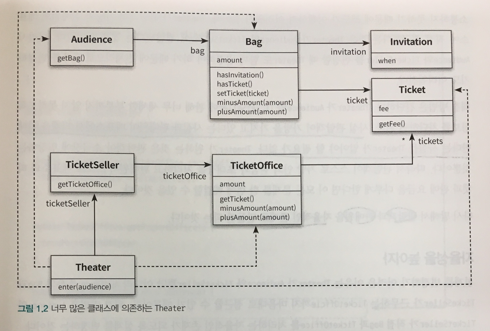
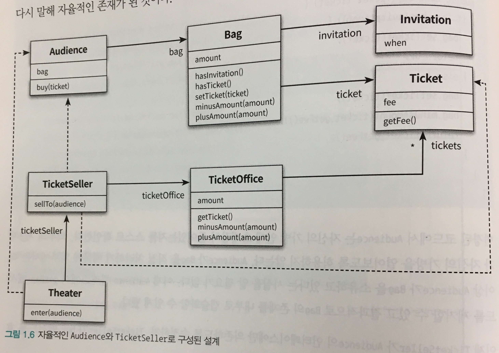
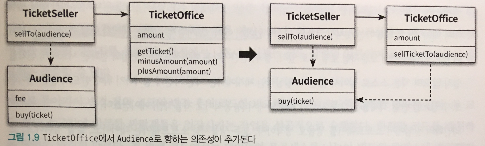

[《오브젝트: 코드로 이해하는 객체지향 설계》](http://book.naver.com/bookdb/book_detail.nhn?bid=15007773)의 '객체, 설계' 파트를 읽고 정리한 내용입니다.

### "이론이 먼저일까, 실무가 먼저일까?"

> 어떤 분야를 막론하고, 이론을 정립할 수 없는 **초기에는 실무가 먼저 급속한 발전**을 이룬다. (...) 해당 분야가 충분히 성숙해지는 시점에 이르러서야 이론이 실무를 추월하게 된다. - _Rober L. Glass (소프트웨어 크리에이비티 2.0 中)_

상대적으로 짧은 소프트웨어 분야의 역사를 감안하면, **이론보다 실무가 더 앞서 있으며 실무가 더 중요하다는 것.**

훌륭한 객체지향 프로그램을 설계하고 유지보수하는 데 필요한 원칙과 기법을 이해하려면🤔

- 추상적인 개념과 이론은 훌륭한 코드를 작성하는데 필요한 도구일 뿐이다.
- 프로그래밍을 통해 개념과 이론을 배우는 것이 훌륭한 학습 방법

# 현실 세계의 어플리케이션



## 소프트웨어 모듈의 세 가지 목적

클린 소프트웨어 (Robert C. Martin)에 따르면,

1. 실행 중에 제대로 동작 (모듈의 존재 이유)
2. 간단한 작업만으로 변경 가능
3. 코드를 읽는 사람과 의사소통

**요약하면, 모든 모듈은 제대로 실행돼야 하고, 변경이 용이해야 하며, 이해하기 쉬워야 한다.🤟🏻**

## 무엇이 문제인가

```typescript
// Theater.ts
public enter(audience: Audience) {
  if (audience.getBag().hasInvitation()) {
      const ticket = this.ticketSeller.getTicketOffice().getTicket();
      audience.getBag().setTicket(ticket);
  } else {
      const ticket = this.ticketSeller.getTicketOffice().getTicket();
      audience.getBag().minusAmount(ticket.getFee());
      this.ticketSeller.getTicketOffice().plusAmount(ticket.getFee());
      audience.getBag().setTicket(ticket);
  }
}
```

_소극장은 관람객의 가방을 열어 그 안에 초대장이 있는지 살펴본다. 초대장이 들어 있으면 판매원은 매표소에 보관돼 있는 티켓을 관람객의 가방 안으로 옮긴다. 가방 안에 초대장이 들어 있지 않다면 관람객의 가방에서 티켓 금액 만큼의 현금을 꺼내 매표소에 적립한 후에 매표소에 보관돼 있는 티켓을 관람객의 가방 안으로 옮긴다.._

## 위 코드의 문제점

- **🙀관람객과 판매원이 소극장의 통제를 받는 수동적인 존재**

  소극장이 가방에 접근? 소극장이 매표소의 티켓과 현금에 마음대로 접근?😱

- **🙀우리의 예상을 빗나간다.**

  이해 가능한 코드 = 우리의 예상에서 크게 벗어나지 않는 코드.
  우리의 상식과 다르게 동작하기 때문에 읽는 사람과 제대로 의사소통하지 못한다.

- **🙀이해하기위해 여러가지 세부적인 내용을 기억하고 있어야 한다.**

  `Audience`가 `bag`을 가지고 있고, `Bag` 안에는 현금과 티켓이 있으며, `TicketSeller`가 `TicketOffice`에서 티켓을 판매하고...🤯 ⇒ 하나의 클래스나 메서드에서 너무 많은 세부사항 ⇒ 부담..😔

- **🙀변경에 취약**

  이 코드는 관람객이 현금과 초대장을 보관하기 위해 항상 가방을 들고 다닌다고 가정한다 ⇒ 관람객이 가방을 들고 있지 않다면? 관람객이 현금이 아니라 신용카드로 결제한다면?😭 ⇒ 객체 사이의 **의존성** 문제

### 의존성 (Dependancy)

- 의존성은 변경과 관련되어 있다. 변경에 대한 영향을 암시 ⇒ 어떤 객체가 변경될 때 그 객체에게 의존하는 다른 객체도 함께 변경될 수 있다는 사실 내포
- 의존성을 없애는 것이 답은 아님. OOD는 서로 의존하면서 협력하는 객체들의 공동체를 구축하는 것.
- ⇒ 우리의 목표는 **최소한의 의존성만 유지하고 불필요한 의존성을 제거**하는 것💪🏻

### 결합도 (Coupling)

- 의존성이 과한 경우 = 결합도가 높다 / 객체들이 합리적인 수준으로 의존 = 결합도가 낮다.
- 결합도는 의존성과 관련돼 있기 때문에 결합도 역시 변경과 관련됨
- 설계의 목표: 객체 사이의 결합도를 낮춰 변경이 용이한 설계를 만드는 것! 💪🏻

# 설계 개선하기

로버트 마틴이 이야기한 세 가지 중 두 조건은 만족시키지 못한다. 기능은 제대로 수행하지만 이해하기 어렵고 변경하기가 쉽지않다. ⇒ `Theator`가 관람객의 가방과 판매원의 매표소에 직접 접근하기 때문 ⇒ 변경과 의사소통 문제는 서로 엮여 있다.

## 해결 방법

`Theater`가 `Audience`와 `TicketSeller`에 관해 너무 세세한 부분까지 알지 못하도록 정보를 차단!

- 사실 관람객이 가방을 가지고 있다라는 사실, 판매원이 매표소에서 티켓을 판매한다는 사실 ⇒ `Theater`가 알아야 할 필요가 없다.
- 관람객이 스스로 가방 안의 현금과 초대장을 처리 / 판매원이 스스로 매표소의 티켓과 판매 요금 처리 ⇒ 관람객과 판매원을 **자율적인 존재**로 만들자

### 캡슐화 (Encapsulation)

- 개념적이나 물리적으로 객체 내부의 세부적인 사항을 감추는 것
- 목적: 변경하기 쉬운 객체를 만드는 것
- 객체 내부로의 접근을 제한하여 결합도를 낮출 수 있다. ⇒ 쉬운 변경

### 인터페이스와 구현 (Interface and Implement)

`Theater`를 오직 `TicketSeller`의 **인터페이스(interface)**에만 의존하도록 변경 ⇒ `TicketSeller`가 내부에 `TicketOffice` 인스턴스를 포함하고 있다는 사실은 **구현(implement)**의 영역.

인터페이스와 구현으로 나누고 인터페이스만 공개하는 것은 객체 사이의 결합도를 낮추고 변경하기 쉬운 코드를 작성하기 위해 따라야 하는 가장 기본적인 설계 원칙!



### 무엇이 개선됐는가

- `Audience`와 `TicketSeller`는 자신이 가지고 있는 소지품을 스스로 관리 (우리의 예상과 일치)
- `Audience`나 `TicketSeller`의 내부 구현을 변경하더라도 `Theater`는 변경할 필요 없음

### 캡슐화와 응집도

🐣핵심: 객체 내부의 상태를 캡슐화하고 객체 간에 오직 메시지를 통해서만 상호작용

- e.g. `Theater`는 `TicketSeller`의 내부에 대해서는 전혀 모름. 단지 sellTo 메시지를 이해하고 응답할 수 있다는 사실만 알고 있을 뿐이다.
- 응집도(cohesion)이 높다 = 밀접하게 연관된 작업만을 수행하고 연관성 없는 작업은 다른 객체에 위임한다.
- 응집도를 높이려면? 객체 스스로 자신의 데이터를 책임진다.👊🏻 (=자신의 데이터를 스스로 처리하는 자율적인 존재여야함)

# 절차지향과 객체지향

- Process: 수정 이전의 Theater의 enter 메서드
- Data: `Audience`, `Bag` 등

### **절차적 프로그래밍 (Procedural Programming)**

- 프로세스와 데이터를 별도의 모듈에 위치시키는 방식
- 프로세스를 담당하는 Theater가 많은 데이터에 의존 ⇒ 직관에 위배된다.
- 데이터의 변경으로 인한 영향을 지역적으로 고립시키기가 어렵다. (한번에 하나의 클래스만 변경할 수 없음) ⇒ 변경하기 어려운 코드를 양산하는 경향이 있음

### **객체지향 프로그래밍 (Object-Oriented Programming)**

- 데이터와 프로세스가 동일한 모듈 내부에 위치하도록 프로그래밍 하는 방식
- **훌륭한 객체지향 설계의 핵심**
  - 캡슐화를 이용해 의존성 관리 ⇒ 객체 사이의 결합도 낮추기
  - 적절한 객체에 적절한 책임 할당 (객체가 어떤 데이터를 가지느냐보다 중요한 것: **객체에 어떤 책임을 할당할 것이냐**)

## 트레이드오프 (Trade-off)



1. 어떤 기능을 설계하는 방법은 한 가지 이상일 수 있다.
2. 동일한 기능을 한 가지 이상의 방법으로 설계할 수 있기 때문에 결국 설계는 트레이드 오프의 산물이다.

결정하는 기준? 우리가 세상을 바라보는 직관과 일치하도록 **(직관을 따르는 코드가 이해하기 쉽다.)**

### 👪의인화 (Anthropomorphism)

- 능동적이고 자율적인 존재로 소프트웨어 객체를 설계하는 원칙 (비록 현실에서는 수동적인 존재라고 하더라도 객체 지향의 세계에 들어오면 모든 것이 능동적이고 자율적)

> 객체는 무생물이거나 심지어는 실세계의 개념적인 개체로 모델링될 수도 있지만, 그들은 마치 우리가 현실 세계에서 에이전트로 행동하는 것처럼 그들의 시스템 안에서 에이전트처럼 행동한다. (...) **객체들은 그들 자신의 체계 안에서 능동적이고 자율적인 에이전트다.** 의인화의 관점에서 소프트웨어를 생물로 생각하자. 모든 생물처럼 소프트웨어는 태어나고, 삶을 영위하고, 그리고 죽는다.

- 훌륭한 객체지향 설계란 **소프트웨어를 구성하는 모든 객체들이 자율적으로 행동하는 설계** (실세계에서는 수동적인 존재라고 하더라도)

# 객체지향 설계

> "설계란 코드를 배치하는 것이다." _- Sandi Matz (루비로 배우는 객체지향 디자인 中)_

설계를 구현과 떨어트려서 이야기하는 것은 불가능하다. 설계는 매 순간 코드를 어떻게 배치할 것 인지를 결정하는 과정에서 나온다.

- **좋은 설계란?** 오늘 요구하는 기능을 온전히 수행하면서 내일의 변경을 매끄럽게 수용할 수 있는 설계
- **변경을 수용할 수 있는 설계가 중요한가?** 요구사항은 항상 변경되기 때문, 코드를 변경할 때 버그가 추가될 가능성이 높기 때문
- **우리가 진정으로 원하는 것?** 변경에 유연하게 대응할 수 있는 코드.

객체지향 패러다임은 세상을 바라보는 방식대로 코드를 작성할 수 있게 돕는다. 데이터와 프로세스를 객체 안으로 밀어 넣었다고 변경하기 쉬운 설계를 얻을 수 있는 것은 아님. 객체지향의 세계에서 **애플리케이션은 객체들로 구성**되며 **애플리케이션의 기능은 객체들 간의 상호 작용들 통해 구현**된다. 그리고 **객체들 사이의 상호작용은 객체 사이에 주고 받는 메시지로 표현**된다.

⇒ 훌륭한 객체지향 설계란 **협력하는 객체 사이의 의존성을 적절하게 관리하는 설계👏🏻**
